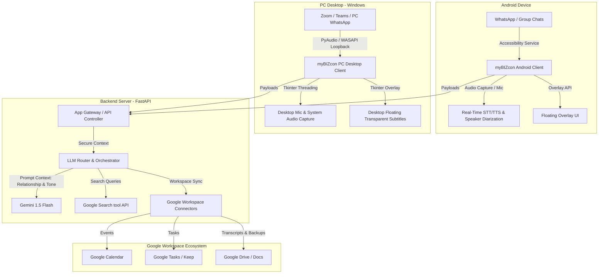

# 🌐 Universal AI Business Assistant (myBIZcon) Implementation Plan [APPROVED]

Welcome! This approved implementation plan outlines the strategic decisions, technical architecture, and phase-by-phase development schedule for **myBIZcon (Universal AI Business Assistant)**—a personal business intelligence system that bridges communication channels (WhatsApp, Meetings, PC Notifications, etc.) with the Google Workspace ecosystem (Calendar, Tasks, Keep, Drive, Docs) using advanced LLM-powered orchestration.

---

## ⚖️ Strategic Feasibility Assessment & Tech Selection

Before diving into the development phases, we must align on two critical technical decisions: **AI Model Selection** and **Target Platform Selection**. Below is an engineering evaluation of the options.

### 1. AI Model Selection: Google Gemini vs. Meta Llama 3

| Criteria | Google Gemini (1.5 Flash / Pro) | Meta Llama 3 (Cloud / On-Device) |
| :--- | :--- | :--- |
| **Workspace Integration** | 🌟 **Superior**: Direct ecosystem integration with Google APIs. Gemini is designed to orchestrate Workspace data seamlessly. | ⚠️ **Manual**: Requires building complex API connectors, tool-calling pipelines, and mapping data schemas manually. |
| **Context Window** | 🌟 **Unmatched (up to 2M tokens)**: Can ingest massive chat histories, multi-party group chats, and long meeting transcripts for high-accuracy RAG. | ⚠️ **Limited (8k - 128k)**: Requires aggressive summarization and chunking of chat transcripts. |
| **Multilingual (Korean)** | 🌟 **Excellent**: Out-of-the-box native understanding of Korean business nuances, honorifics, and dual translation. | 📈 **Moderate**: Llama 3 is strong, but sometimes lacks deep local context and localized business etiquette defaults. |
| **Latency & Cost** | 🌟 **Low Latency (Flash)**: Gemini 1.5 Flash provides near real-time token generation at extremely low cost. | ⚠️ **High Infrastructure Cost**: Cloud deployment (e.g., RunPod, AWS) is expensive. On-device is slow and drains mobile battery. |
| **Privacy & Compliance**| 📈 **Enterprise Cloud Privacy**: Governed by Google Cloud's data isolation agreements (no model training on customer data). | 🌟 **Ultimate Privacy**: If run fully on-premise, data never leaves the client's network. |

> [!TIP]
> **Decision: Google Gemini (Core) + Llama 3 Adapter Pattern**
> We use **Google Gemini (Gemini 1.5 Flash)** as the primary translation and orchestration engine for the MVP. Its low latency (crucial for live audio/text translation) and native Google API integrations are perfect. However, we will build a **modular LLM interface layer** (Adapter Pattern) so that the core logic can easily swap to a self-hosted **Meta Llama 3** engine in the future if required for enterprise local-data compliance.

---

### 2. Platform Selection: Android & PC Co-Existence

| Capability | Android Client (Kotlin) | PC Client (Python Tkinter) |
| :--- | :--- | :--- |
| **On-Screen Capture** | 🌟 **Accessibility Services**: Scrapes WhatsApp messages. | 🌟 **Win32 / PyAutoGUI**: Monitors desktop notifications and active messenger windows. |
| **Audio Capture** | 🌟 **Internal Audio Capture / Mic**: Captures VOIP calls and live in-person meetings. | 🌟 **PyAudio / WASAPI Loopback**: Captures PC system audio (Zoom/Slack calls) and microphone inputs. |
| **Overlays** | 🌟 **System Overlays**: Floating bubbles over WhatsApp. | 🌟 **Frameless Transparent Tkinter Overlays**: Floating roll subtitles on Windows desktop. |
| **Compilation** | 🌟 **APK Build**: Gradle-assembled production package. | 🌟 **PyInstaller EXE**: Zero-dependency executable. |

> [!IMPORTANT]
> **Decision: Multi-Platform Ecosystem (Android APK + PC Windows Client)**
> To deliver a comprehensive bi-modal ecosystem:
> 1.  **Android Client (Kotlin)**: Scrapes mobile WhatsApp/messengers, renders custom overlays, and captures VoIP calls/meetings. Compiles into an **APK** via Android Studio/Gradle.
> 2.  **PC Desktop Client (Python Tkinter)**: Monitors PC notifications, captures system audio (Zoom, Teams, Slack calls) using loopback, renders frameless floating subtitles directly on Windows, and communicates with the FastAPI backend. Compiles into a single **EXE** via PyInstaller.
> 3.  **FastAPI Backend (Python)**: Unified gateway handling core AI requests and Google Workspace Sync for both clients.

---

## 📐 High-Platform Unified Architecture

---

## 📋 Comprehensive 4-Phase Implementation Plan (Revised)

### 🚀 Phase 1: Architecture, Security, Prompt Engineering & GIT Setup [Completed]
*   Git workspace connection and cumulative JSON execution tracker initialization.
*   Relationship prompting definitions and REST simulation client testing.

---

### 📦 Phase 2: MVP Development - WhatsApp Message Integration & Google Sync [Completed]
*   Android Accessibility scraping configurations and floating translation Overlay implementation.
*   FastAPI backend endpoints and Google Workspace Sync integrations (Calendar, Tasks, Drive Markdown).

---

### 🖥️ Phase 2.5: PC Desktop Client Development & APK Build Pipeline [NEW]
*   **2.5.1 PC Desktop Client (Tkinter)**:
    *   Build a beautiful frameless dark-themed desktop dashboard using **Tkinter**.
    *   Implement **Windows Floating Overlays**: Semi-transparent, click-through overlay labels to show live subtitles and translations over PC Zoom/WhatsApp.
    *   Create desktop notification grabber/monitor.
    *   Implement **WASAPI Loopback Capture**: Capture system sound (speaker output) and local mic input for call recording.
*   **2.5.2 Android APK Compilation Setup**:
    *   Create Gradle compilation scripts (`build.gradle`, `settings.gradle`) and automated batch scripts (`build_apk.bat`) for zero-click local Gradle compiling into an **APK** file.

---

### 🎙️ Phase 3: Real-Time Audio Capture, Meeting Mode & Voice Pipeline [In Progress]
*   Implement VoIP call audio capturing (mobile) and PC audio pipeline integrations.
*   Create **Speaker Diarization** logic (separating voices: Speaker A, B, User) for physical meetings (using the mic) and Zoom/Teams calls (using loopback).
*   Integrate OpenAI Whisper STT, Gemini translation, and ElevenLabs/Google TTS.
*   Develop Search-Assisted Web Copilot (floating facts bubble).

---

### 🧬 Phase 4: Multi-Messenger Expansion & Hyper-Personalized RAG
*   KakaoTalk, Slack, and Telegram scraper adapters for both mobile and desktop.
*   Contextual RAG pipeline: Ingest historical transcripts from Google Drive, train embedding vectors, and personalize tone generation to sound exactly like the user.

---

## 🛠️ Git Synchronization & Execution Tracking Guidelines

To ensure robust progress tracking, error logging, and flexible design iterations:
1.  **Tracker Setup**: All workspace actions will be tracked in `d:\Python Programs\myBIZcon\mybizcon_tracker.json`. This tracker will include:
    *   `run_count`: Incrementing counter of steps executed.
    *   `current_stage`: Current phase of implementation.
    *   `last_commit_hash`: Git hash of the latest sync.
    *   `operations_log`: Cumulative array of steps, actions taken, code changes, and debug statuses.
2.  **Continuous Git Sync**:
    *   Before making significant changes, execute a `git pull` from the remote repository.
    *   After completing a discrete step or writing a component, execute `git add`, `git commit` (with detailed commit messages referencing step counts), and `git push` to `https://github.com/Gimsphil/myBIZcon.git`.

---

## ⚠️ User Review Required

> [!WARNING]
> ### 1. PC Audio Capturing (WASAPI Loopback)
> Windows loopback capture requires specialized PyAudio/SoundCard setups. We will supply detailed setup guidelines and zero-dependency mock inputs to ensure the PC Client works seamlessly on standard Windows environments.
