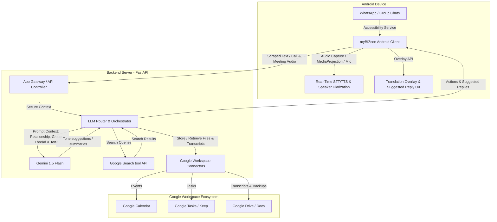

# 🌐 Universal AI Business Assistant (myBIZcon) Implementation Plan [APPROVED]

Welcome! This approved implementation plan outlines the strategic decisions, technical architecture, and phase-by-phase development schedule for **myBIZcon (Universal AI Business Assistant)**—a personal business intelligence system that bridges communication channels (WhatsApp, Meetings, etc.) with the Google Workspace ecosystem (Calendar, Tasks, Keep, Drive) using advanced LLM-powered orchestration.

---

## ⚖️ Strategic Feasibility Assessment & Tech Selection

Before diving into the development phases, we must align on two critical technical decisions: **AI Model Selection** and **Target Platform Selection**. Below is an engineering evaluation of the options.

### 1. AI Model Selection: Google Gemini vs. Meta Llama 3

| Criteria | Google Gemini (1.5 Flash / Pro) | Meta Llama 3 (Cloud / On-Device) |
| :--- | :--- | :--- |
| **Workspace Integration** | 🌟 **Superior**: Direct ecosystem integration with Google APIs. Gemini is designed to orchestrate Workspace data seamlessly. | ⚠️ **Manual**: Requires building complex API connectors, tool-calling pipelines, and mapping data schemas manually. |
| **Context Window** | 🌟 **Unmatched (up to 2M tokens)**: Can ingest massive chat histories, multi-party group chats, and long meeting transcripts for high-accuracy RAG. | ⚠️ **Limited (8k - 128k)**: Requires aggressive summarization and chunking of chat transcripts. |
| **Multilingual (Korean)** | 🌟 **Excellent**: Out-of-the-box native understanding of Korean business nuances, honorifics, and dual translation. | 📈 **Moderate**: Llama 3 is strong, but sometimes lacks deep local context and localized business etiquette defaults. |
| **Latency & Cost** | 🌟 **Low Latency (Flash)**: Gemini 1.5 Flash provides near real-time token generation at extremely low cost. | ⚠️ **High Infrastructure Cost**: Cloud deployment (e.g., RunPod, AWS) is expensive. On-device is slow and drains mobile battery. |
| **Privacy & Compliance**| 📈 **Enterprise Cloud Privacy**: Governed by Google Cloud's data isolation agreements (no model training on customer data). | 🌟 **Ultimate Privacy**: If run fully on-premise, data never leaves the client's network. |

> [!TIP]
> **Decision: Google Gemini (Core) + Llama 3 Adapter Pattern**
> We use **Google Gemini (Gemini 1.5 Flash)** as the primary translation and orchestration engine for the MVP. Its low latency (crucial for live audio/text translation) and native Google API integrations are perfect. However, we will build a **modular LLM interface layer** (Adapter Pattern) so that the core logic can easily swap to a self-hosted **Meta Llama 3** engine in the future if required for enterprise local-data compliance.

---

### 2. Platform Selection: Android vs. iOS

| Capability | Android (Kotlin / Java) | iOS (Swift) |
| :--- | :--- | :--- |
| **Accessibility Services** | 🌟 **Allowed**: Can read on-screen text from WhatsApp and KakaoTalk, identify senders, and draw translation overlays. | ❌ **Forbidden**: Sandbox isolation strictly prohibits apps from reading other apps' screens or UI hierarchies. |
| **System/App Audio Hook** | 🌟 **Possible**: Using `MediaProjection` or internal audio capture APIs (Android 10+), we can capture system audio for calls. | ❌ **Forbidden**: Cannot capture third-party call audio due to sandboxing privacy restrictions. |
| **Background Orchestration** | 🌟 **Flexible**: Can run persistent background services and listeners to monitor incoming notifications. | ⚠️ **Highly Restricted**: Background tasks are throttled and terminated by the system. |
| **Custom Overlays** | 🌟 **Supported**: Can draw system alert windows directly on top of WhatsApp to show live captions/translations. | ❌ **Forbidden**: Overlay windows on top of third-party apps are not supported. iOS only allows keyboard extensions. |

> [!IMPORTANT]
> **Decision: Android-First MVP Architecture**
> To build an agent that integrates directly into **unmodified WhatsApp** (without paying for WhatsApp Business API fees or forcing the counterparty to use a custom app), **Android is the only viable platform**. We will develop the mobile side as an Android Application utilizing **Android Accessibility Services** and background overlays.
>
> To support future iOS expansion, we will adopt a **Mobile-Backend Split Architecture**:
> - **Backend (FastAPI/Python)**: Handles core LLM processing, Google API authentication, web search, and RAG vector databases.
> - **Android App (Kotlin)**: Acts as a thin client that scrapes screen text, intercepts audio, renders overlays, and communicates with the backend.
> - *Future iOS App*: Can leverage the same backend but will be limited to a Custom Keyboard Extension (no accessibility scraping/overlays).

---

## 📐 High-Level Architecture & Data Flow

---

## 📋 Comprehensive 4-Phase Implementation Plan

### 🚀 Phase 1: Architecture, Security, Prompt Engineering & GIT Setup
Establish the development repository, define the relationship-based personas, design guardrails, and set up cumulative tracking.

*   **1.1 Git Repository Setup**:
    *   Create a subfolder `d:\Python Programs\Empecting\myBIZcon` (the user's workspace).
    *   Initialize a local Git repository and connect it to `https://github.com/Gimsphil/myBIZcon.git`.
    *   Maintain a cumulative file `d:\Python Programs\Empecting\myBIZcon\mybizcon_tracker.json` to record every single development run, operation counts, debugging logs, and active status.
*   **1.2 Relationship-based Prompt Engineering**:
    *   Design system prompt templates for different relations:
        *   `BOSS`: formal, respectful, concise, proactive.
        *   `BUYER/CLIENT`: extremely polite, structured, persuasive, prompt.
        *   `COWORKER`: professional yet collaborative, clear, precise.
        *   `FAMILY/FRIEND`: casual, warm, conversational.
    *   Parameters for adjusting emotional tone, language style (business/casual), and brevity.
*   **1.3 Human-in-the-Loop (HITL) Security & Guardrails**:
    *   Create strict schema boundaries: The AI **cannot** automatically invoke send commands.
    *   The UI must enforce an explicit "User Review & Click to Send" step.
    *   Scope-bounded Google OAuth consent screens (requesting only required scopes for Calendar, Tasks, Keep, Drive).

---

### 📦 Phase 2: MVP Development - WhatsApp Message Integration & Google Sync
Develop the core scraper, translation presentation overlay, and Google API ingestion pipelines.

*   **2.1 Accessibility-based Text Scraper (Android)**:
    *   Configure Android Accessibility Service XML (`accessibility_service_config.xml`).
    *   Filter events for package `com.whatsapp`.
    *   Scrape incoming messages, identify sender name, and group logs by conversation threads.
*   **2.1.2 Multi-Party Group Conversation Support [NEW]**:
    *   Identify individual sender names/tags within group chats.
    *   Establish threading context in group conversations (who is replying to whom).
    *   Update AI prompts to understand the multi-party group dynamics and tailor suggested replies accordingly.
*   **2.2 Translation & Mode Overlay**:
    *   Build a lightweight background Overlay Service (`TranslationOverlayService`).
    *   Draw elegant, floating UI bubbles/panels.
    *   Provide three display options:
        1.  *Translation Only*: Hides raw text, displays translated text.
        2.  *Original + Translation*: Dual stacked rows (premium layout, recommended).
        3.  *Original Only*: Displays raw text with a hover translation button.
*   **2.3 Real-Time Suggested Reply Generator**:
    *   Analyze incoming scraped messages on the backend.
    *   Construct prompt payload with relationship profile.
    *   Generate 3 alternative response options (e.g., Accept, Defer, Decline) with different tones.
    *   Inject selected draft directly into WhatsApp's input field using Accessibility action input injection (`ACTION_SET_TEXT`).
*   **2.4 Google Workspace One-Click Integration Pipeline**:
    *   **Google Calendar**: Parse dates/times from chat (e.g., "Let's meet tomorrow at 3 PM") and format Google Calendar Event payloads.
    *   **Google Tasks & Keep**: Extract action items (To-Dos) and notes, automatically sync via the Google Tasks API.
    *   **Google Drive**: At the end of a chat session, package the transcripts into a clean Markdown format and upload to a structured `myBIZcon/Chats/` folder on Google Drive.

---

### 🎙️ Phase 3: Real-Time Audio Capture, Meeting Mode & Translation (Advanced)
Implement VoIP call audio capturing, meeting voice processing, speaker diarization, low-latency STT/TTS pipeline, and the Web Search assistant.

*   **3.1 Voice Call Capture Hook**:
    *   Capture VoIP audio playback using Android `AudioRecord` / `MediaRecorder` or system audio redirection APIs.
    *   Route downstream audio (caller's voice) and upstream audio (user's microphone) into separate channels.
*   **3.1.2 Meeting Mode [NEW]**:
    *   Implement **Physical Meeting Mode**: Use the device microphone to record in-person meetings.
    *   Implement **Speaker Diarization**: Separate voices (Speaker A, Speaker B, User) using acoustic features or Gemini's audio processing capabilities.
    *   Generate detailed **Meeting Minutes (회의록)** in Google Docs/Drive with:
        *   Full text transcripts indexed by speakers.
        *   Automated executive summary and decisions.
        *   Action items assigned to specific meeting participants.
*   **3.2 Low-Latency STT/TTS Engine**:
    *   Implement **OpenAI Whisper (API / Local)** for lightning-fast speech-to-text.
    *   Process text through the translation layer (Gemini).
    *   Convert translation to high-quality audio stream using **Google Cloud TTS** or **ElevenLabs API** (for natural human voice output).
*   **3.3 Floating Live Subtitle Overlay**:
    *   Display rolling subtitles of the caller's translated speech in a semi-transparent, premium overlay screen on top of the call UI.
*   **3.4 Search-Assisted Web Copilot**:
    *   Gemini reads call/message context. If a user says "What was the price of X?" or mentions a competitor, a background worker searches the web.
    *   Display key facts in a neat floating bubble.
    *   Reference link is attached to the chat summary and saved in Google Drive.

---

### 🧬 Phase 4: Multi-Messenger Expansion & Hyper-Personalized RAG
Scale the system to other corporate/personal messengers and utilize historical chats for personalized tone adjustments.

*   **4.1 Multi-Messenger Scraping Adapters**:
    *   Scale the Accessibility Service configuration to cover KakaoTalk (`com.kakao.talk`), Slack (`com.Slack`), and Telegram (`org.telegram.messenger`).
*   **4.2 Contextual RAG (Retrieval-Augmented Generation) Pipeline**:
    *   Index historical chat logs and documents stored in Google Drive.
    *   Extract user's writing habits, common phrases, and preferred idioms.
    *   Generate embeddings (using `text-embedding-004`) and store in a lightweight database.
    *   Pre-pend typical user response samples to LLM prompts to produce highly personalized reply suggestions that sound exactly like the user.

---

## 🛠️ Git Synchronization & Execution Tracking Guidelines

To ensure robust progress tracking, error logging, and flexible design iterations:
1.  **Tracker Setup**: All workspace actions will be tracked in `d:\Python Programs\Empecting\myBIZcon\mybizcon_tracker.json`. This tracker will include:
    *   `run_count`: Incrementing counter of steps executed.
    *   `current_stage`: Current phase of implementation.
    *   `last_commit_hash`: Git hash of the latest sync.
    *   `operations_log`: Cumulative array of steps, actions taken, code changes, and debug statuses.
2.  **Continuous Git Sync**:
    *   Before making significant changes, execute a `git pull` from the remote repository.
    *   After completing a discrete step or writing a component, execute `git add`, `git commit` (with detailed commit messages referencing step counts), and `git push` to `https://github.com/Gimsphil/myBIZcon.git`.

---

## ⚠️ User Review Required

> [!WARNING]
> ### 1. Google Client Authentication Credentials
> To integrate with Google Workspace, we will need to create a project on the Google Cloud Console, enable **Calendar**, **Tasks**, **Keep**, and **Drive** APIs, and generate `credentials.json` (OAuth 2.0 client credentials). You will need to download and place this file securely.
>
> ### 2. Android Accessibility Service Permissions
> For scraping WhatsApp, users must manually grant the "Accessibility Permission" in Android Settings. We must implement high-quality visual onboarding tutorials inside the app to guide the user safely, as this permission is highly protected by Google Play.

---

## ❓ Open Questions

> [!IMPORTANT]
> - **Q1: Which backend framework do you prefer?** FastAPI (Python) is highly recommended since all AI/STT components are Python-friendly. Alternatively, we can use Node.js (Express/NestJS) if that matches your existing server stack.
> - **Q2: For Voice Translation (Phase 3), which TTS engine should we prioritize?** **Google Cloud TTS** (highly cost-effective and low-latency) or **ElevenLabs** (extremely premium, natural human voices, supports voice cloning)?
