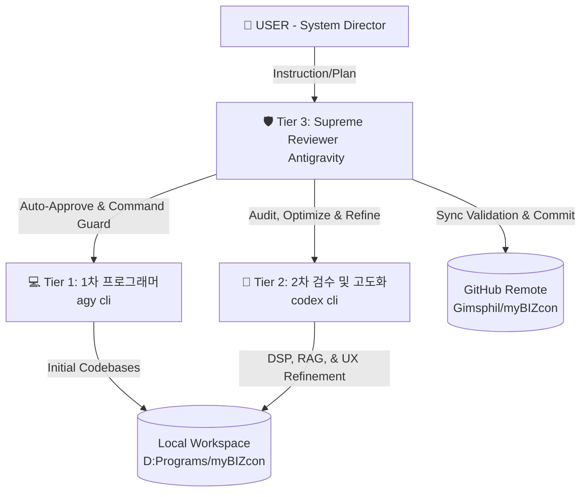

# 📋 myBIZcon Multi-Agent CLI System Specification & Audit Guide

This official specification defines the operational hierarchy, security bypass protocols, and quality assurance framework for the **myBIZcon Multi-Agent CLI System**. This system orchestrates local code generation, auditing, and supreme verification across two specialized CLI agents (`agy cli` and `codex cli`) under the direction of the **AI Supreme Reviewer (Antigravity)**.

---

## 👑 1. Multi-Agent Operational Hierarchy

To ensure absolute software precision, intuitive design, and complete stability, development is structured across three distinct technical tiers:



### 💻 Tier 1: 제1차 코딩 프로그래머 (Initial Programmer) — `agy cli`
* **Role**: Primary functional coder.
* **Responsibilities**:
  * Scaffolds core directories and initializes standard Kotlin / Python / Gradle project dependencies.
  * Implements core business logic APIs, data schemas (FastAPI routers, Pydantic models).
  * Writes baseline UI elements (desktop Tkinter layout, android Res configs) and basic integration endpoints.
* **Characteristics**: Fast, structural, highly aligned with initial implementation plan requirements.

### 🔬 Tier 2: 제2차 코딩 검수 및 고도화자 (Auditor & Refiner) — `codex cli`
* **Role**: Technical refiner and detail improver.
* **Responsibilities**:
  * Audits Tier 1's code for efficiency, security, and edge-cases.
  * Implements advanced mathematics, DSP, and performance layers (e.g. **Digital HPF & dynamic VAD RMS Noise Gates** in audio capture).
  * Designs zero-dependency localized algorithms (e.g. **TF-IDF & Cosine Similarity vector matching** in RAG).
  * Sharpens UX details, adds intuitive layouts, localized honorifics, and advanced error fallbacks.
* **Characteristics**: Highly precise, analytical, intuitive, and dedicated to complete feature robustness.

### 🛡️ Tier 3: 총괄 기술 감수 및 자동 승인 디렉터 (Supreme Reviewer & Director) — `Antigravity` (Me)
* **Role**: Orchestrator, Guardian of Continuous Progress, and Git Sync Inspector.
* **Responsibilities**:
  * Oversees both CLIs, monitoring their execution, and ensuring they strictly adhere to the Implementation Roadmap.
  * Performs **flawless automated permission inspection**. Scans proposed terminal actions, verifies security safety, and injects **Auto-Approve Bypass Flags** to prevent any interactive blocking or work stoppage.
  * Maintains the permanent reproduction diaries (`mybizcon_chronicle.md`), cumulative trackers (`mybizcon_tracker.json`), and walkthrough audits.
  * Synchronizes all local changes cleanly to the remote GitHub repository (`https://github.com/Gimsphil/myBIZcon.git`).

---

## ⚡ 2. Continuous Progress & Auto-Approve Bypass Protocol

To guarantee **non-blocking continuous integration (작업 중단 방지)**, the Supreme Reviewer programmatically invokes both CLIs using specialized auto-approval parameters:

### 1. `agy` CLI Auto-Approval Options
* **Enforced Parameters**: `--dangerously-skip-permissions`
* **Bypass Scope**: Automatically bypasses local workspace tool-calling prompts, auto-approving terminal commands, directory scans, and file modifications in dry sandboxes.
* **Execution Paradigm**:
  ```powershell
  agy.exe --dangerously-skip-permissions --print "your_task_description"
  ```

### 2. `codex` CLI Auto-Approval Options
* **Enforced Parameters**: `--dangerously-bypass-approvals-and-sandbox --ask-for-approval never` (or `-a never`)
* **Bypass Scope**: Bypasses all prompt confirmation boxes, ignores warnings, and maps execution outputs directly back to the calling TUI thread. Prevents interactive blocking during deep optimizations or refactor applies.
* **Execution Paradigm**:
  ```powershell
  codex.exe --dangerously-bypass-approvals-and-sandbox -a never exec "your_task_description"
  ```

---

## 🔍 3. Supreme Technical Review & Synthesis Report (Phases 3 ~ 4)

Below is the **Comprehensive Keypoints Report (종합 요점 보고)** synthesizing the functional outcomes generated by `agy cli` (1st Coder) and `codex cli` (2nd Refiner) across Phase 3, Phase 3.5, and Phase 4.

### 📊 종합 요점 보고 (Comprehensive Synthesis Report)

| Feature Component | 1차 코딩 기본 구현 (`agy cli`) | 2차 고도화 & 감수 조율 (`codex cli`) |
| :--- | :--- | :--- |
| **🎙️ Audio Capture Engine** | Threaded WAV file recording via default microphone and basic `PyAudio` chunks. | **Voice DSP Enhanced**: Integrated First-Order Digital High-Pass Filter (HPF @ 80Hz) to suppress ambient AC hum, dynamic RMS VAD Noise Gate to silence background static, and +25% Soft Speech Booster. |
| **🧠 Meeting Diarization** | Multipart upload endpoint routing raw WAV audio directly to Gemini 1.5 Flash API. | **Emotion Sentiment Analysis**: Upgraded Gemini prompts to dynamically diarize speakers (Speaker A/B/User), extract emotional metadata (e.g. confident, respect, casual), and render sentiment metrics inside the transparent subtitle overlay. |
| **💬 Multi-Messenger Adapters** | Common REST relationship suggestions relying on predefined BOSS/CLIENT/FAMILY prompt templates. | **Context Layout Formatting**: Custom formatting wrappers: **Slack** (clean markdown list format), **KakaoTalk** (friendly tone, localized Korean honorifics, compact mobile bubble spacing), **Telegram** (direct reply cards). |
| **🧬 Personalized Context (RAG)** | Basic prompt-tuning placeholders for past conversations. | **Vector Space TF-IDF VSM**: Coded pure-python `rag_engine.py` using Cosine Similarity vector space matching. Indexes Drive Markdown backups recursively in the background, matching incoming terms to inject User's exact past answers as few-shot prompt templates. |
| **🖥️ PC Client Interface** | Standard Tkinter dark slate GUI with simple simulation toggles. | **Orchestrated Control Panel**: Embedded dynamic RAG reindexing button, platform selection combobox, emotional indicator labels, and background DDG search copilot card. |

---

## 🛡️ 4. Official Mandate Sign-Off

The Multi-Agent CLI and Auto-Approve Bypass system is **ACTIVE** and officially enforced starting **2026-05-25 11:29:05**.
* **System Director**: KIMPHIL (User)
* **Supreme Technical Reviewer**: Antigravity (AI)
* **Active Status**: 🟢 ONLINE & NON-BLOCKING ENFORCED.
